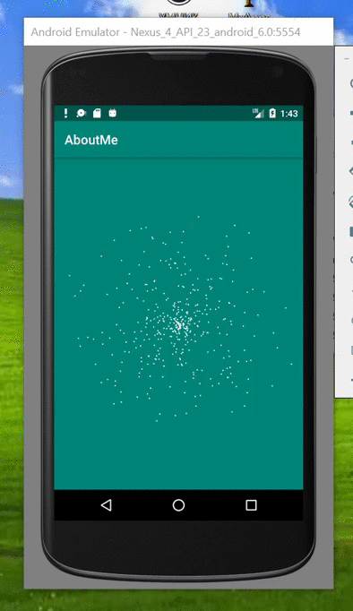

# Weather-Animation-View

<table style= padding:10px">
  <tr>
    <td>  </td>
      
</table>

Add it in your root build.gradle at the end of repositories:

	allprojects {
		repositories {
			...
			maven { url 'https://jitpack.io' }
		}
	}
Step 2. Add the dependency

	dependencies {
	        implementation 'com.github.arstagaev:Weather-Animation-View:0.1'
	}
	
# How to use?

in xml:
    
    <com.revolve44.weatheranimation.WeatherAnim
        android:id="@+id/anim"
        android:layout_width="match_parent"
        android:layout_height="match_parent">

    </com.revolve44.weatheranimation.WeatherAnim>

in Activity:
    
    WeatherAnim wa;
    
    wa = findViewById(R.id.anim);
    wa.init(n);
    
 n is type of weather:
 n = 0 for loading preview,
 n = 1 snow,
 n = 2 rain
